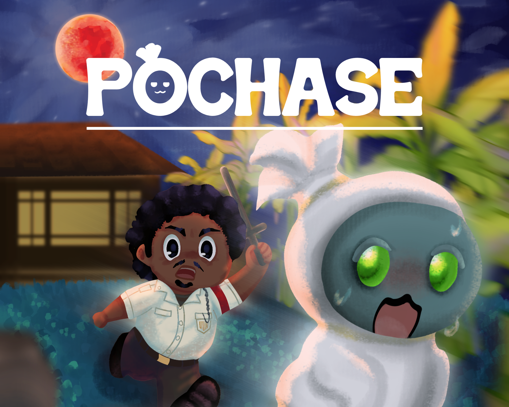

# Pochase: Pocong on the loose 🪦

### 🎮✨ Mempersembahkan sebuah mahakarya dari Party 11: Th1ngk1ng🎮✨

Sebuah game platformer vertikal dimana player (pocong) dikejar oleh pos para bapak-bapak pos kamling dan melarikan diri agar tidak dikuburkan kembali. Player akan menghadapi berbagai rintangan untuk diloncati dan dihindari dalam pelariannya. Bukan hanya melompati dan menghindari, player juga bisa mendapatkan power-up.

## Play the game here 👾🎯

### 🪦[Pochase (beta)](https://muhalcon.itch.io/pochase-11)🪦

## The Wiki 📖
Get to know more about the mechanism of the game here in the development wiki 👇

### 🎯[Development Wiki](wiki/main.md)🎯

## The Team

### Game Production:

- #### Amy (Lead Developer)

### Programmers:

- Jovan (Lead Programmer)

- Rafi ( Programmer HR Management, System Routing & RnG System )

- Kres ( Scoring System & Asset Connecting )

- Peter ( Hit box & Invincibility Mechanic )

- Marvel ( Health System & Movement Mechanic )

### Visual Artist:

- Audrey (Lead Artist  & UI Design)

- Khalisya (Quality Management & Character Sprite Illustration)

- Farah (Obstacle Illustration)

- Anisa (Obstacle Illustration)

- Dito (Map Design)

### Audio Artist:

- Amy (SFX)
  
- Aurel (BGM)

## Credits
- quick woosh by florianreichelt -- https://freesound.org/s/683101/ -- License: Creative Commons 0 (SFX)
- DUB DUP KIK.wav by BaDoink -- https://freesound.org/s/561403/ -- License: Creative Commons 0 (SFX)